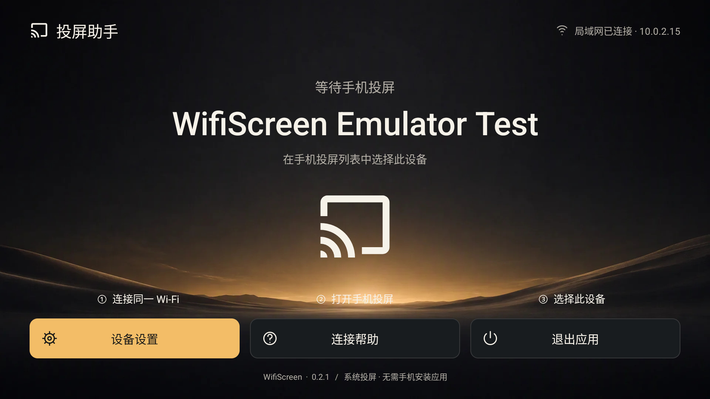

# 投屏助手 · WifiScreen

把小米 / Redmi 手机的画面和声音，投到**极米投影仪等 Android 投影仪或电视**上。

**安装在电视 / 投影仪上，手机直接使用系统投屏。** 无需手机配套 App，无需 Root，应用不设置投屏时长限制。

**[TV App Store 下载与更新](https://tvstore.jinshanweb.com/app-detail.html?id=9)** · [GitHub Releases](https://github.com/kangjinshan/WifiScreen/releases) · [反馈问题](https://github.com/kangjinshan/WifiScreen/issues)

当前源码版本为 **0.3.1**，支持 H.264 / H.265 选择、Xiaomi HyperOS 新版投屏协商和 10 秒设备 / 网络评估，保留此前的画面修复与低延迟功能。安装包以 TV App Store 页面显示的版本为准；GitHub Releases 目前仍为 0.2.1。



*上图是 0.2.1 的模拟器界面。连接时，请选择你电视首页显示的设备名称；真实设备默认名称为「WifiScreen 投影」，也可以自行修改。*

## 先确认你的设备

| 设备 | 要求 |
| --- | --- |
| 电视 / 投影仪 | **极米等可安装 APK 的 Android 投影仪 / 电视**，Android 5.0 或更新版本 |
| 手机 | **小米 / Redmi 的系统投屏**，重点适配 Xiaomi HyperOS |
| 网络 | 手机与电视在同一局域网，设备之间可以互相访问；电视也可接网线 |

**极米 Z6X（Android 9）已验证基础 H.264 音画投屏。** 0.3.1 的 H.264 / H.265 新版协商、连续关键帧、声音接收和 10 秒评估已通过原版 HyperOS 投屏组件与电视模拟器测试。

真实手机到极米投影仪的 H.265 画面、声音、口型同步和长时间运行仍需按机型确认；不能据此认定所有极米型号均已验证。其他手机品牌、iPhone、Mac、Windows 的投屏兼容性尚未验证。

## 下载与安装

1. 打开 **[TV App Store 应用页面](https://tvstore.jinshanweb.com/app-detail.html?id=9)**，下载页面显示的最新版 APK。也可从 [GitHub Releases](https://github.com/kangjinshan/WifiScreen/releases) 下载已发布的历史版本。
2. 将 APK 复制到 U 盘，插入电视或投影仪，用设备的文件管理器打开 APK 并安装。也可以使用局域网文件传输工具，或在电视浏览器中下载。
3. 安装完成后，在电视的应用列表中打开 **投屏助手**。

更新时安装新版 APK 即可。使用本仓库发布的相同签名版本，可以覆盖安装并保留设置。

## 三步开始投屏

1. **连好网络。** 手机与电视连接同一局域网，避免使用开启设备隔离的访客 Wi-Fi。
2. **打开电视上的投屏助手。** 看到「等待手机投屏」后，记住屏幕中央的设备名称。
3. **打开手机的系统投屏。** 在小米 / Redmi 手机上，下拉控制中心，打开「投屏」，选择电视上显示的名称。

连接成功后，手机画面会自动显示到大屏，声音随可被手机系统捕获的音频一起传输。旋转手机时，画面会按横竖屏重新适配。

使用期间请让投屏助手保持前台；切换到其他电视应用或退出投屏助手，会停止接收。

## 用遥控器操作

以下操作适用于 **0.2.0 及更新版本**。

| 当前画面 | 按键 / 操作 | 效果 |
| --- | --- | --- |
| 正在全屏投屏 | 确认、菜单、向下或返回 | 打开投屏操作菜单 |
| 菜单或设置页 | 方向键 + 确认 | 选择并执行操作，暖金色表示当前焦点 |
| 投屏菜单 | 返回 | 收起菜单，继续投屏 |
| 画面调整 / 连接信息 | 返回 | 回到投屏菜单 |
| 想结束投屏 | 菜单 → 结束投屏 → 确认 | 断开手机，回到等待连接页 |
| 等待连接页 | 返回 | 退出应用 |

## 常用设置

设备名称、画面模式、缩放位置、实时速率开关和编码首选会自动保存。

| 想做什么 | 在哪里操作 |
| --- | --- |
| 显示完整画面 | 投屏菜单 → **画面调整 → 完整显示**，保留全部内容，比例不同时可能有黑边 |
| 让画面铺满屏幕 | 投屏菜单 → **画面调整 → 铺满屏幕**，保持比例放大，部分边缘可能被裁切 |
| 放大、缩小或移动 | 投屏菜单 → **画面调整 → 手动调整**，支持 50%–300% 缩放、方向移动与居中 |
| 撤销画面调整 | 在画面调整中选择 **恢复默认** |
| 修改投屏名称 | 首页 → **设备设置 → 设备名称**，例如改为「客厅投影」 |
| 静音 / 恢复声音 | 投屏菜单 → **静音 / 恢复声音** |
| 查看实时帧率与接收速度 | 首页 → **设备设置 → 显示实时速率** |
| 投屏画面突然偏色 | 0.2.9 起：投屏菜单 → **修复画面** |
| 选择 H.264 / H.265 | **设备设置 → 视频编码**；保存后下次投屏请求使用 |
| 判断更适合哪种编码 | **设备设置 → 视频编码 → 开始 10 秒测试**，结束后可选择「使用推荐」 |

还没连接手机时，也可以通过 **设备设置 → 默认画面** 提前设置显示方式。设备名称过长或含不支持的字符时，应用会提示修改。

### 编码选择与 10 秒测试

默认使用 H.264。H.265 通常能减少相同画质需要的带宽，也需要电视具备足够解码能力。缺少可用的 1080p H.265 解码器时，该选项不可选。

测试在未投屏时运行，用同一组合成动态画面的 H.264 / H.265 版本各解码 5 秒，同时采样当前局域网的信号、连接速率和网关响应。结果提供解码帧率、P95 耗时、推荐与原因，可取消、查看上次结果或手动采用推荐，不会自动修改设置。测试期间新投屏暂不能接入。

选择 H.265 后，会向小米 / Redmi HyperOS 发布新版连接能力，并在 Lelink v2 镜像会话中协商 H.265；选择 H.264 后请求 H.264。0.3.1 补齐了配对校验、加密控制、视频接入和声音协商，已使用原版 HyperOS 投屏组件与电视模拟器验证。

**最终以实际收到的编码为准。** 投屏菜单 → **编码 / 信息** 可查看首选与实际编码；若手机缓存了旧设备信息，请关闭再打开系统投屏，刷新设备列表后重新连接。不同手机和投影硬件的效果仍需实机确认。

测试基于 1080p30 的本机解码与局域网参考指标，没有测量手机编码、手机到电视的实际吞吐或端到端延迟。网关不响应探测时显示未知；链路 Mbps 不等于可用带宽。更换网络、清晰度或手机后可重新评估。H.265 的「修复画面」暂需断开后重新投屏。

## 常见问题

<details>
<summary><strong>手机投屏列表里找不到设备</strong></summary>

- 确认电视已经打开投屏助手，并停留在等待连接页。
- 确认两台设备在同一局域网，未使用隔离设备的访客网络。
- 关闭并重新打开手机的投屏列表。
- 在电视上打开 **连接帮助 → 重新发布接收设备**，再试一次。

如果手机品牌或系统版本不同，投屏协议也可能不同；看到「投屏」选项并不一定代表兼容。

</details>

<details>
<summary><strong>网络断开后，怎样继续投屏？</strong></summary>

0.2.0 会在网络恢复后自动重新发布接收设备。看到「接收服务已恢复」后，在手机投屏列表中重新选择电视上的设备名称。电视不能代替手机发起投屏。

</details>

<details>
<summary><strong>画面有黑边，或者边缘被裁掉了</strong></summary>

先选择 **画面调整 → 完整显示**。竖屏手机投到横屏电视上，左右留黑边是正常的。

希望铺满时选择 **铺满屏幕**，但这会裁掉部分内容。也可以用手动缩放和移动找到合适的位置；调整乱了就选择 **恢复默认**。

</details>

<details>
<summary><strong>画面正常，但没有声音</strong></summary>

检查电视音量，以及投屏菜单是否开启了静音。只有手机系统允许捕获的声音才能传到电视；不同手机系统和正在使用的 App 可能有不同限制。

0.2.2 修复了部分发送端音频时间戳不兼容、反复清空播放缓冲导致无声的问题。新版诊断会区分音频已接收与播放已启动；计数器不能代替实际听感确认。

0.2.4 对短暂缺口使用附近波形补偿、平滑接回真实音频；较长缺口接续时同步调整视频显示。持续断流仍可能听出中断，缺失的原始声音无法完整还原。

如果 0.2.4 出现杂音，请升级到 0.2.5。新版连续音频原样播放，仅在确认存在音频缺口时补偿，避免把成批到达的正常声音误替换。

</details>

<details>
<summary><strong>投屏卡顿、延迟较大，或者画面停住</strong></summary>

先检查网络连接，尽量靠近路由器；条件允许时让电视使用有线网络。结束本次投屏后重新连接，并确认使用的是最新发布版本。

0.2.3 缩短接收端视频队列，在积压时加速解码、跳过过时画面的显示，追上手机后恢复正常播放节奏。完整保留解码需要的参考帧。

0.2.6 会在音画时钟偏差异常时回退到独立视频节奏，避免把持续到达的新画面全部当作过期帧丢弃。

0.2.7 等待显示时仍继续接收和解码；缓冲压力较大时优先保持画面更新，避免音频同步等待把视频帧率拖低。实际帧率和音画同步效果仍取决于设备性能与输出路径。

0.2.8 将解码后的额外显示等待预算收紧到 20ms，并在音频时钟切换尚未稳定时保持独立视频节奏，减少画面被误判为过期而丢弃。20ms 不包含手机编码、网络、硬件解码和投影显示耗时；声音输出较慢的设备仍需同时确认音画同步。

如果问题反复出现，请按下面的方式提交设备信息与诊断报告。画面和声音的实际延迟还取决于手机、网络与电视，接收端缓冲数值不代表整条投屏链路的延迟。

</details>

<details>
<summary><strong>投屏画面偏红或颜色异常，但菜单颜色正常</strong></summary>

0.2.9 起可以打开投屏菜单，选择 **修复画面**。应用先保存修复前诊断，继续播放并等待新的完整关键帧，收到后只重新启动视频解码器。声音和投屏连接保持，画面可能短暂闪黑。

目前等待手机自然发送关键帧；2 秒内没有收到完整、支持修复的关键帧时，会保留当前播放并提示在手机断开后重新投屏。连续修复至少间隔 30 秒。提示「视频已重新启动」只表示画面输出已恢复，颜色是否正常仍需实际查看；若仍偏色，请重新投屏。

最近一次修复前诊断保存在应用私有目录，在重连或应用重启后仍可通过详细诊断查看，下次修复覆盖。报告只包含状态和参数，不保存投屏音视频。程序不会根据画面偏红程度或投屏时长自动重启。

</details>

<details>
<summary><strong>APK 无法安装，或提示与现有应用冲突</strong></summary>

确认设备运行 Android 5.0 或更新版本，并重新下载完整的 APK。如果系统限制安装外部应用，请从电视系统提供的安装设置入口处理。

本仓库发布的 APK 使用同一签名。其他来源自行编译、使用不同签名的安装包，可能无法直接覆盖现有版本。

</details>

## 遇到问题，怎样反馈？

到 **[GitHub Issues](https://github.com/kangjinshan/WifiScreen/issues)** 描述问题，并附上：

- 投屏助手版本、手机型号及系统版本。
- 电视 / 投影仪型号及 Android 版本。
- 出现问题前做了什么，以及是连接、画面还是声音异常。

0.2.0 可在 **设备设置 → 设备诊断 → 查看详细报告** 查看接收状态。手机与电视处于同一局域网时，也可以在手机浏览器打开：

```text
http://电视首页显示的IP:47110/diagnostics
```

例如，首页显示 `192.168.1.100`，地址就是 `http://192.168.1.100:47110/diagnostics`。诊断页面仅在投屏助手保持前台时可用，提供只读状态；应用不会把投屏画面和声音保存成文件。

## 开源与开发

WifiScreen 使用 [MIT 许可证](LICENSE)。开发者可查看 [构建与实现说明](docs/development.md)、[测试说明](docs/testing.md)、[界面设计](docs/design.md) 和 [第三方组件说明](THIRD_PARTY_NOTICES.md)。

AI 协作与修改入口见 [AGENTS.md](AGENTS.md)。
